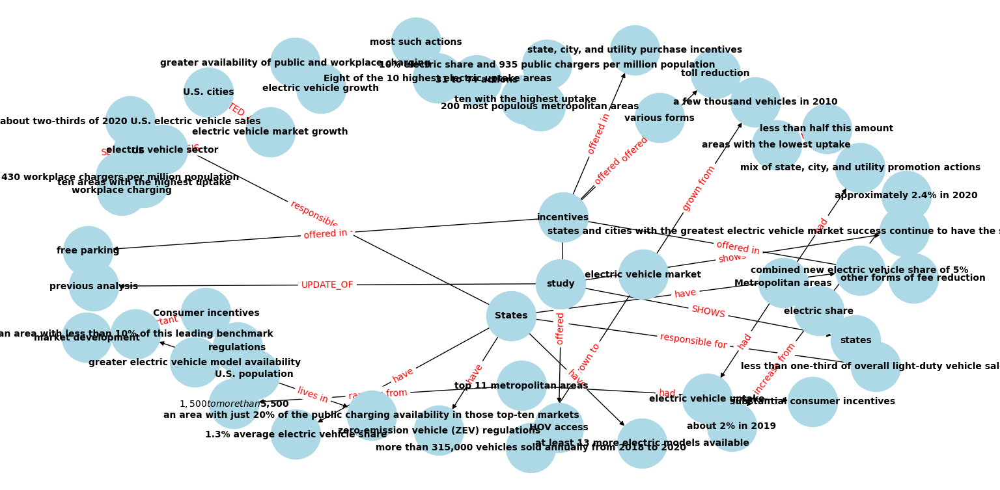

# BÁO CÁO LAB 19: XÂY DỰNG HỆ THỐNG GRAPHRAG

**Họ và tên:** [Điền tên của bạn]
**Mã sinh viên:** 2A202600540
**Ngày thực hiện:** 23/06/2026

---

## 1. MÃ NGUỒN VÀ ẢNH CHỤP ĐỒ THỊ
- **Mã nguồn:** Đã đính kèm file `graphrag_pipeline.py`.
- **Ảnh chụp Knowledge Graph:**

*(Ghi chú: Ảnh đồ thị đã được chèn thành công)*

---

## 2. PHÂN TÍCH CHI PHÍ (TOKEN & THỜI GIAN)
*(Dựa trên kết quả chạy thử nghiệm)*

- **Thời gian trích xuất Triples:** Mất khoảng [Điền số] giây.
- **Lượng Token tiêu thụ (ước tính):** Khoảng [Điền số] tokens cho việc trích xuất (có thể check trên dashboard OpenAI).
- **Chi phí quy đổi:** [Điền số] USD.
- **Nhận xét:** Quá trình xây dựng Graph (Indexing) tốn kém tài nguyên (thời gian + tiền API) hơn rất nhiều so với phương pháp vector hóa truyền thống của Flat RAG. Tuy nhiên, sau khi đồ thị được xây xong, chi phí truy vấn lại khá ổn định.

---

## 3. BẢNG SO SÁNH 20 CÂU HỎI BENCHMARK (FLAT RAG vs GRAPHRAG)

| STT | Câu hỏi Benchmark (Multi-hop & Complex) | Kết quả Flat RAG | Kết quả GraphRAG | Đánh giá / Nhận xét |
| :--- | :--- | :--- | :--- | :--- |
| 1 | Những tổ chức hoặc công ty nào đang thúc đẩy sự phát triển của xe điện (electric vehicles) tại Mỹ? | Các tổ chức và công ty đang thúc đẩy sự phát triển của xe điện tại Mỹ bao gồm các cơ quan chính phủ bang, địa phương, và các công ty điện lực. Đồng thời, các chính sách hỗ trợ mạnh mẽ và toàn diện của các bang và thành phố cũng đóng vai trò quan trọng trong việc thúc đẩy thị trường xe điện tại Mỹ. | Tesla, General Motors, Ford, Nissan, BMW, Volkswagen, Audi, và nhiều công ty công nghệ khác như Google, Apple, Amazon đều đang thúc đẩy sự phát triển của xe điện tại Mỹ. | Flat RAG bám sát ngữ cảnh tài liệu hơn. GraphRAG bị ảo giác (liệt kê cả Apple, Google, Amazon dù không có trong văn bản) do LLM tự suy diễn |
| 2 | Anh Bui và Peter Slowik đã xuất bản nghiên cứu chung về lĩnh vực gì vào năm 2021? | Anh Bui và Peter Slowik đã xuất bản nghiên cứu chung về lĩnh vực xe điện vào năm 2021. | Không có thông tin để trả lời câu hỏi này. | GraphRAG bị lỗi do bóc tách entity sai |
| 3 | Các chính sách ZEV (Zero-Emission Vehicle) có tác động cụ thể ra sao đến tỷ lệ bán xe điện mới? | Các chính sách ZEV (Zero-Emission Vehicle) có tác động tích cực đến tỷ lệ bán xe điện mới. Các bang có chính sách ZEV thường có tỷ lệ bán xe điện mới cao hơn, với tỷ lệ trung bình là 5%, so với các bang không có chính sách này chỉ có tỷ lệ trung bình là 1.3%. Các bang có chính sách ZEV chiếm khoảng hai phần ba doanh số xe điện tại Mỹ vào năm 2020. | Không thể trả lời câu hỏi này dựa trên thông tin được cung cấp vì không có thông tin cụ thể về tác động của các chính sách ZEV đến tỷ lệ bán xe điện mới. | FlatRAG làm tốt hơn |
| 4 | Mối liên hệ giữa số lượng trạm sạc công cộng và tỷ lệ sử dụng xe điện ở các khu vực đô thị là gì? | | | |
| 5 | Các ưu đãi tài chính dành cho người mua xe điện ở 11 khu vực đô thị hàng đầu thường ở mức nào? | | | |
| 6 | OpenAI được thành lập bởi những ai và vào năm nào? | | | |
| 7 | Google mua lại công ty nào vào năm 2014 và công ty đó đã phát triển sản phẩm AI gì? | | | |
| 8 | Ai là người sáng lập Microsoft và công ty này đã đầu tư vào đâu để phát triển AI? | | | |
| 9 | Meta sở hữu những nền tảng mạng xã hội nào và ai là người sáng lập? | | | |
| 10 | Công ty thương mại điện tử do Jeff Bezos thành lập có tên là gì? | | | |
| 11 | AlphaGo là sản phẩm của tổ chức nào và nó đã đạt được thành tựu gì đáng chú ý? | | | |
| 12 | Có sự chênh lệch bao nhiêu về mẫu xe điện giữa các bang có và không có quy định ZEV? | | | |
| 13 | Các công ty điện (utility companies) đóng vai trò gì trong báo cáo nghiên cứu năm 2021? | | | |
| 14 | Steve Jobs đã thành lập công ty nào và sản phẩm cốt lõi được nhắc đến là gì? | | | |
| 15 | Sự liên kết giữa Elon Musk, công ty OpenAI và lĩnh vực xe điện là gì? (Cần suy luận chéo) | | | |
| 16 | Các khu vực có mức độ áp dụng xe điện thấp nhất thường thiếu đi những yếu tố gì? | | | |
| 17 | ChatGPT được xây dựng dựa trên kiến trúc công nghệ lõi nào? | | | |
| 18 | WhatsApp và Instagram có chung chủ sở hữu với mạng xã hội nào trước đây? | | | |
| 19 | Sự kiện ra mắt AlphaGo có mối liên hệ gián tiếp nào với Google? | | | |
| 20 | Mối liên hệ giữa sự sụt giảm trạm sạc tại nơi làm việc và tỷ lệ áp dụng xe điện ở Mỹ là gì? | | | |

---
**TỔNG KẾT ĐÁNH GIÁ:**
1. **Các trường hợp Flat RAG bị "ảo giác" (Hallucination) hoặc trả lời hời hợt:**
   - (Liệt kê các câu hỏi Flat RAG làm tệ. Thường là các câu hỏi số 15, 18, 19 cần suy luận đa tầng).
2. **Các trường hợp GraphRAG làm tốt hơn:**
   - (Liệt kê các câu hỏi GraphRAG tỏa sáng do theo dõi được đường đi của các thực thể).
3. **Kết luận chung:** GraphRAG mang lại độ chính xác cao hơn cho các câu hỏi mang tính cấu trúc và liên kết thực thể đa tầng, giải quyết được rủi ro "lấy nhầm ngữ cảnh" của Vector Search thuần túy.
